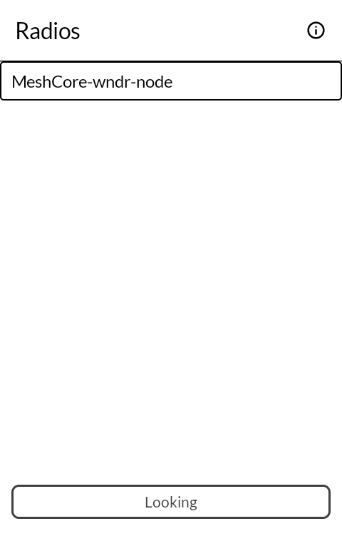
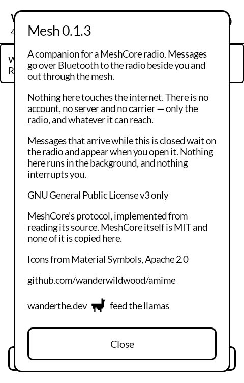

# 網目 amime — Mesh

A [MeshCore](https://meshcore.co.nz/) companion client for the
[Mudita Kompakt](https://mudita.com/products/kompakt/) and its E Ink screen. Talks to a LoRa
radio over Bluetooth and sends messages through a mesh that needs no towers, no carrier and
no internet.

*Amime* is 網目 — the eye of a net, the gap the weave makes. Which is the shape of the thing:
not the nodes but the spaces they hold open between them.

Not a fork. Written from scratch in Kotlin, on Mudita's own
[MMD](https://github.com/mudita/MMD) design system, as the rest of these apps are.

| | |
|---|---|
|  |  |

<!-- Two of the four. The other two want a radio with a contact in it — the people list with
     somebody in it, and a conversation showing a message still waiting against one
     acknowledged — and there is no second node yet to be that somebody. They go in when
     there is one; the emulator has no Bluetooth to a real radio, so they cannot be staged. -->

## Where this is up to

**Version 0.1.0.** 136 tests, green, and it has been talking to a radio for days rather than
in theory. The commands and frames are written against `examples/companion_radio/MyMesh.cpp`
in the MeshCore firmware rather than against the protocol documentation, for a reason given
below. The session — handshake order, draining the message queue, matching an acknowledgement
to the send that expected it — has no Android in it at all, so those rules are tested without
a radio or a phone.

Proven against a ThinkNode M5 on companion-v1.16.0: the handshake, the contact sync, reading
and setting the radio parameters, the battery, and counting what the antenna hears whether or
not any of it was readable.

**It has never sent or received a message.** Not because that path is untried in the
laboratory sense but because there is nobody to send one to: this is the only node here, it
has heard nothing since moving to 915 MHz, and a contact list with nothing in it is a
conversation screen that has never run against a peer. A repeater is on its way, and the
first real question it answers is that one.

Part of the reason nobody could have answered is worth stating plainly, because it was this
app's fault rather than the mesh's: **a companion node advertises only when it is told to.**
It has no advert timer — that is a repeater's job, and `simple_repeater` defaults to one
every couple of minutes — so `createSelfAdvert` in the companion firmware is reachable from
exactly two places: a button on the node's own screen, and `CMD_SEND_SELF_ADVERT` from
whatever app is attached. This app had that command written and never called it, which makes
a radio nobody can add as a contact and therefore nobody can write to. There is a press for
it now, at the foot of the people list.

Still to come, and waiting on the same thing: sending, the delivery states against a real
acknowledgement, and administering a repeater over the air — which is built, and which has
never been exercised against a repeater because there has not been one. Two of the four
screenshots want the same.

## The documentation is wrong in at least one place that matters

`docs/companion_protocol.md` presents `0x03` as the opcode for sending a text message. It is
not. In the firmware, 3 is `CMD_SEND_CHANNEL_TXT_MSG` and 2 is `CMD_SEND_TXT_MSG`, so a
client written to the documentation broadcasts every private message to a group channel — and
does it silently, because the radio accepts the frame and answers that it was sent.

Several other things in that document are worth distrusting: it gives the datagram opcode a
number belonging to a different command, and states that no way of listing contacts is
documented, when `CMD_GET_CONTACTS` is opcode 4 and has been all along. Everything in
`Codes.kt` is transcribed from the firmware source instead, and `CommandsTest` has a test
whose only job is to fail if the message opcode is ever "corrected" back.

## Things the firmware does that are worth knowing

- **The radio must be told what the app understands, and it only listens once.**
  `CMD_DEVICE_QUERY` carries a protocol version in its second byte, and that is the sole
  place the firmware reads it. Until it arrives the radio treats the app as version 0 and
  answers with a pre-v3 message layout that has no SNR and different offsets for every field
  after it. Nothing reports an error; the messages simply decode to rubbish.
- **Bonding is mandatory.** The GATT is configured with MITM protection on both the ESP32 and
  nRF52 builds, so the phone has to pair rather than merely connect. The PIN is 123456 unless
  it has been changed, and the device reports its own in the reply to `CMD_DEVICE_QUERY`.
- **A contact is addressed by six bytes, not thirty-two.** Messages carry a six-byte prefix
  of the public key in both directions, so a contact table keyed on the whole key cannot
  answer who sent something.
- **`PUSH_CODE_MSG_WAITING` carries nothing** — no count, no sender. The only correct response
  is to call `CMD_SYNC_NEXT_MESSAGE` until the radio says there are no more.
- **A signed message hides four bytes in front of its text.** `TXT_TYPE_SIGNED_PLAIN` puts a
  four-byte sender prefix between the header and the body; read as text, it is the rubbish on
  the front of the message.
- **The contact count is not how many contacts are coming.** `RESP_CODE_CONTACTS_START` gives
  the node's total, and the `since` filter is applied afterwards, so a sync that asks for
  recent changes gets a count far larger than the number of frames that follow.
- **Frequency and bandwidth arrive in different units.** The firmware multiplies a float of
  MHz by 1000 for one and a float of kHz by 1000 for the other, so `SELF_INFO` carries
  frequency in kHz and bandwidth in Hz.

## How far a message got, and the four ways that stops being a question

The thing this app has to say that an ordinary messaging app does not is how far a message
actually got, because on a mesh that is a real question with a long answer.

A message is **dotted** while the outcome is genuinely unknown — handed to the radio, or
accepted and waiting on an acknowledgement — and **solid** once it is settled. Settled means
the outcome is *known*, not that it was good: a refusal is solid, and so is the radio
answering that no acknowledgement is coming at all. Leaving that last one dotted would be the
screen claiming something is still in flight when the radio has already said it is not.

Waiting has to end somewhere, and nothing outside this app ends it. The radio hands back its
own estimate of how long an acknowledgement could take — it knows the airtime, the spreading
factor and the length of the path, and this app knows none of those — and then, when that
estimate runs out, does nothing with it: `onSendTimeout()` in the companion firmware is an
empty function. So the app keeps the time itself, and a message nobody answered stops saying
it is waiting for an answer. That is not the same as saying it failed, and an acknowledgement
that turns up late is still accepted and still settles it.

The two remaining states are about this app rather than the mesh: a message that was still in
flight when Android reclaimed the process comes back saying so, because the answer it wanted
went past while nothing was listening.

The same border does the same job in the people list: solid where the radio knows a route to
a node, dotted where it has only ever reached it by flooding.

A caption appears under a message only where the border cannot carry the meaning, and never
for the ordinary case. An acknowledged message needs no words, and neither does one that
arrived direct and strong. A note on every row is furniture, and furniture stops being read
in the row where it mattered.

## What the Bluetooth side has to get right

The radio marks both characteristics MITM-protected, so the phone must be *bonded*, not
merely connected. Android will start pairing by itself when an unbonded app touches such a
characteristic, but the operation that triggered it is often dropped rather than retried —
most visibly the notification-enable, which leaves a connection that looks healthy and never
delivers a message. So `BleTransport` bonds deliberately and up front and touches nothing
until that has completed.

Two more, both silent when wrong:

- **A frame is one characteristic value.** The firmware calls `setValue` then `notify` and
  never chunks, so the negotiated MTU has to hold the largest frame whole. The default ATT
  MTU of 23 leaves 20 bytes of payload and would cut a 148-byte contact frame to a seventh of
  itself. The MTU is requested before service discovery, not after.
- **Android accepts one GATT operation at a time.** A second write issued before the first
  calls back does not queue and does not throw: it returns false and is dropped, and the
  frame with it. Everything goes through `OperationQueue`, which also has to cope with an
  operation the stack refuses outright — no callback is coming for one of those, so a queue
  that waits for one waits for good.

## What it keeps, and where

Messages are written to a plain file of tab-separated lines in the app's own storage, because
the radio does not keep a copy: a message it has handed over is a message it no longer holds,
so an app that kept them only in memory would lose every one of them the next time Android
reclaimed the process. A message that was still in flight when that happened comes back in a
state of its own rather than as one still waiting — the acknowledgement it wanted went past
while nothing was listening, and saying it is still pending would be a claim nobody can make.

Nothing else is stored. Contacts come off the radio at every connection, which is where they
live; what the antenna heard is about this session and does not outlast it.

## Building

```
./gradlew :app:testDebugUnitTest
```

There is no checked-in signing key and no fallback. Without `signing/signing.keystore` a
release build comes out unsigned, which will not install anywhere.

## Getting it, and keeping it

Download <https://github.com/wanderwildwood/amime/releases/latest/download/amime.apk> and
sideload it. That address always points at the newest release, and every release publishes a
`.sha256` beside the APK if you would rather check than trust.

**The application id is settled** — updates install over what you have, keeping anything the
app has stored.

## Licence

GPL-3.0-only. MeshCore itself is MIT, and is not vendored here — only its protocol is
implemented, from reading its source.
